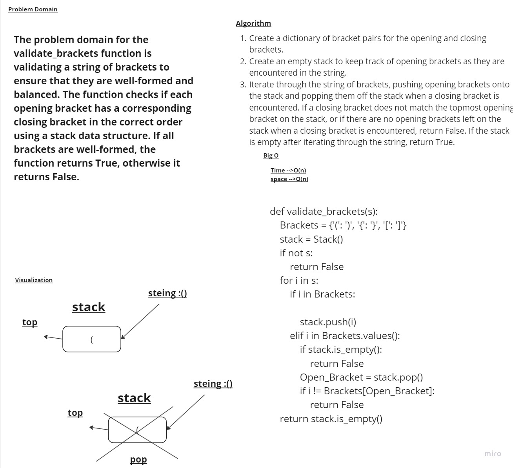

# Whiteboard Process


## Description

This Whiteboard contains the solution for the "Matching Brackets" problem, which deals with validating expressions to ensure that all brackets are properly matched. The primary goal of this project is to provide a clear and efficient algorithm for solving the problem.

## Problem Statement

Given an expression containing only brackets ('(', ')', '{', '}', '[', ']'), the task is to check if the brackets are balanced, i.e., every opening bracket has a corresponding closing bracket, and they are properly nested.

Example:
```
Input: "({[]})"
Output: True

Input: "({[})"
Output: False
```

## Algorithm

The solution implements a stack-based algorithm to validate the brackets' balance. Here's a high-level overview of the algorithm:

1. Create an empty stack to store opening brackets.
2. Iterate through each character in the expression.
3. If the character is an opening bracket ('(', '{', '['), push it onto the stack.
4. If the character is a closing bracket (')', '}', ']'), check if the stack is empty:
    a. If the stack is empty, return False, as there's no corresponding opening bracket.
    b. If the stack is not empty, pop the top element from the stack and check if it matches the closing bracket. If not, return False.
5. After processing all characters, check if the stack is empty:
    a. If the stack is empty, return True (all brackets are balanced).
    b. If the stack is not empty, return False (some opening brackets don't have corresponding closing brackets).


