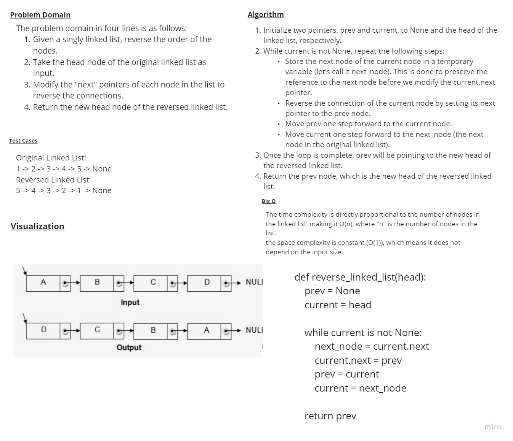

# Whiteboard Process

## Description

This Whiteboard  contains the solution for the "Reverse Linked List" problem, which involves reversing a singly linked list. The main objective of this project is to provide a clear and efficient algorithm to reverse the order of nodes in the linked list.

## Problem Statement

Given a singly linked list, the task is to reverse the order of its nodes. For example, if the linked list is `1 -> 2 -> 3 -> 4 -> 5`, the reversed linked list would be `5 -> 4 -> 3 -> 2 -> 1`.

## Algorithm

The solution implements an iterative approach to reverse the linked list. Here's a high-level overview of the algorithm:

1. Initialize three pointers: `prev`, `current`, and `next`.
2. Set `prev` to `None` and `current` to the head of the linked list.
3. Iterate through the linked list while `current` is not `None`:
    a. Within the loop, store `current.next` in the `next` pointer.
    b. Update `current.next` to point to the previous node (`prev`).
    c. Move `prev` to `current` and `current` to `next`.
4. After the loop, update the head of the linked list to `prev`, which is now pointing to the last node of the original list (the new head of the reversed list).

